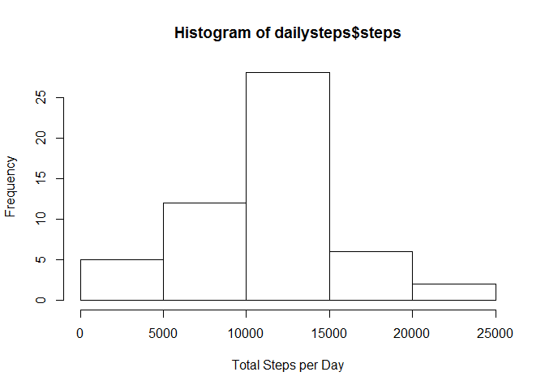
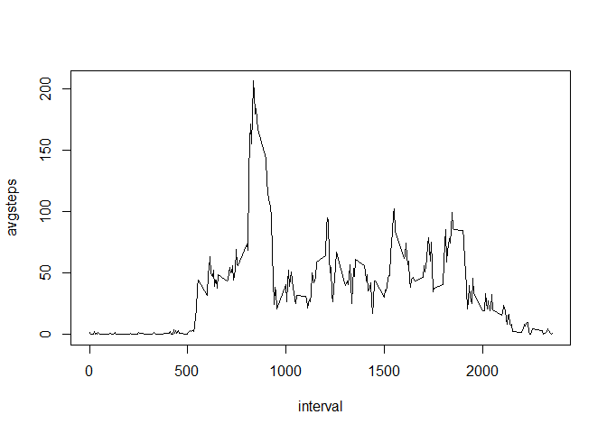
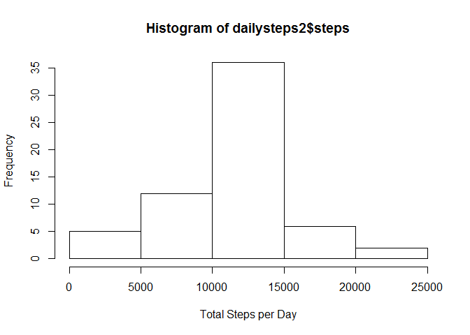
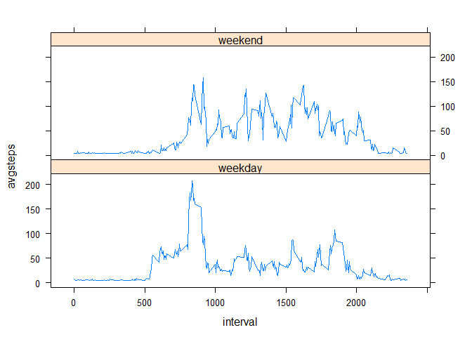

# Reproducible Research: Peer Assessment 1


## Loading and preprocessing the data 

####1. Load the data 

```r
activity <- read.csv("activity.csv")
```

####2. Process/transform the data into a format suitable for your analysis  
We need to create a a second variable, dailysteps, to sum up the total steps per day.

```r
dailysteps <- aggregate(steps ~ date, data=activity, sum)
```

## What is mean total number of steps taken per day? 
####1. Make a histogram of the total number of steps taken each day 
 

####2. Calculate and report the mean and median total number of steps taken per day 

```r
mean(dailysteps$steps)
```

```
## [1] 10766.19
```

```r
median(dailysteps$steps)
```

```
## [1] 10765
```

## What is the average daily activity pattern? 

####1. Make a time series plot of the 5-minute interval and the average number of steps taken, averaged across all days 
First, we must group  all the step data by the interval of the day. We are disregarding the date of the interval. We can use the dplyr library to make this easier.

```r
library(dplyr)
fiveMinSummary <- activity %>% group_by(interval) %>% summarize(avgsteps = mean(steps, na.rm = TRUE))
with(fiveMinSummary, plot(interval, avgsteps, type="l"))
```

 

####2. Which 5-minute interval, on average across all the days in the dataset, contains the maximum number of steps? 

```r
fiveMinSummary[which.max(fiveMinSummary$avgsteps),1]
```

```
## Source: local data frame [1 x 1]
## 
##   interval
## 1      835
```

## Inputing missing values 

####1. Calculate and report the total number of missing values in the dataset 

```r
nrow(activity[!complete.cases(activity),])
```

```
## [1] 2304
```

####2. Devise a strategy for filling in all of the missing values in the dataset. 
The following function will create a vector that is the same length as the total number of missing values. The vector will contain the mean for the 5-minute interval as each element. Then, the function will replace all missing values with the mean value.

```r
replace.na <- function(x){
    vect <- rep(mean(x$steps,na.rm = TRUE),nrow(x[!complete.cases(x),]))
    x[!complete.cases(x),1] <- vect
    x
}
```

####3. Create a new dataset that is equal to the original dataset but with the missing data filled in. 

```r
activity2 <- replace.na(activity)
```

####4. Make a histogram of the total number of steps taken each day 
######Calculate and report the mean and median total number of steps taken per day. 

```r
dailysteps2 <- aggregate(steps ~ date, data=activity2, sum)
```
 

###### Calculate and report the mean and median total number of steps taken per day. 

```r
mean(dailysteps2$steps)
```

```
## [1] 10766.19
```

```r
median(dailysteps2$steps)
```

```
## [1] 10766.19
```
###### Do these values differ from the estimates from the first part of the assignment? 
The mean has remained the same. The median has changed to the same number as the mean.

###### What is the impact of inputing missing data on the estimates of the total daily number of steps? 
I used the mean to replace the NA values, so the mean has remained the same. The median is now the same number as the mean because I have added an excess number of mean values to replace the NA values.

## Are there differences in activity patterns between weekdays and weekends? 

####1. Create a new factor variable in the dataset with two levels -- "weekday" and "weekend" 

```r
activity2$date <- as.Date(activity2$date, tz="","%Y-%m-%d")
activity2$weekday <- ifelse(weekdays(activity2$date) == "Sunday" | weekdays(activity2$date) == "Saturday", "weekend", "weekday")
```

####2. Make a panel plot containing a time series plot of the 5-minute interval and the average number of steps taken, averaged across all weekday days or weekend days. 
We need to load the lattice package to access xyplot, which is perfect for this panel plot.  

```r
library(lattice)
fiveMinSummary2 <- activity2 %>% group_by(interval,weekday) %>% summarize(avgsteps = mean(steps, na.rm = TRUE))
xyplot(avgsteps~interval|weekday, fiveMinSummary2, type="l", layout= c(1,2))
```

 

Yes, the activity patterns are different. Weekends are more uniform in step activity compared to the weekdays, and weekdays has a spike of step activity in the morning.
